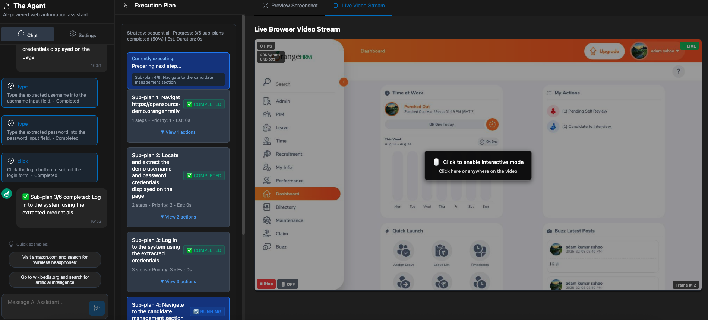

# The agent - AI-Powered Browser Automation Framework

[](https://github.com/Nuralyio/the-agent/actions/workflows/ci.yml)
[](https://github.com/Nuralyio/the-agent/actions/workflows/release.yml)
[](https://www.typescriptlang.org/)
[](./LICENSE)
[](https://nodejs.org/)
[](./CONTRIBUTING.md)

<div align="center">
  <a href="https://youtu.be/-kNVYzFXkLk" target="_blank">
    
  </a>
  <br/>
  <em>Real-time browser automation</em>
</div>

## 🚧 Project Status

**The Agent is in active development (Alpha)**

A comprehensive, AI-powered browser automation framework that understands
natural language instructions and executes web automation tasks intelligently.
the agent provides multi-adapter support for different browser engines with
real-time monitor and monitoring capabilities.

### 📊 Project Completion Status

**Overall Progress: ~30%** �

#### 🔄 In Progress (Alpha Development)

- Core framework stabilization and testing
- Basic error handling and recovery mechanisms
- Essential documentation and setup guides
- Fundamental feature implementation

## ✨ Key Features

- 🤖 **AI-Powered Automation**: Natural language instruction processing using
  multiple AI providers (Ollama, OpenAI, Mistral)
- 🌐 **Multi-Browser Support**: Works with Playwright, Puppeteer, and Selenium
  adapters
- 🎯 **Intelligent Element Detection**: AI-driven element identification and
  interaction
- 📊 **Real-Time Dashboard**: Modern React-based web UI for monitoring and
  control
- 🔄 **WebSocket Integration**: Live automation streaming and status updates
- 🛠️ **CLI Interface**: Command-line tools for scripting and automation
- 🧪 **Unit Testing**: Comprehensive unit test coverage with CI/CD integration

- **Live Execution Monitoring** - Watch your automation tasks execute in
  real-time
- **Plan Monitor** - See complex tasks broken down into manageable sub-plans
- **Action Detail Display** - View target selectors, action types, and execution
  values
- **Browser Preview** - Live browser screenshots and page state
- **Event Stream Integration** - Real-time status updates and progress tracking

## �🏗️ Architecture

This project is organized as a TypeScript monorepo with the following packages:

### 📦 Core Packages

- **`@theagent/core`** - Core automation framework with multi-adapter support
  and AI integration
- **`@theagent/api`** - HTTP API server with WebSocket support for real-time
  communication
- **`@theagent/web-ui`** - Modern Remix-based dashboard for monitoring and
  control
- **`@theagent/cli`** - Command-line interface for automation scripting
- **`@theagent/mcp-server`** - Model Context Protocol server for AI assistant
  integration

### 🔧 Development Tools

- **`tools/test-server/`** - Local test server for automation testing
  (port 3005)
- **`tools/scripts/`** - Development and build scripts
- **`tools/config/`** - Shared configuration files

## 🚀 Quick Start

### Prerequisites

- **Node.js 18+** (recommended: use latest LTS)
- **npm** or **yarn** package manager
- **Git** for version control

### Installation

```bash
# Clone the repository
git clone https://github.com/Nuralyio/the-agent.git
cd the-agent

# Install dependencies for all packages
npm install

# Install browser dependencies (Playwright browsers)
npm run install:browsers
```

### Configuration

The Agent uses a unified configuration system that discovers settings from
multiple sources in order of precedence:

1. **Environment variables** (highest precedence)
2. **Configuration files** discovered hierarchically
3. **Default values** (lowest precedence)

#### Configuration Files

Create a `theagent.config.js` file in your project root or any parent directory:

```bash
# Copy the template and customize
cp theagent.config.template.js theagent.config.js
```

Example configuration:

```javascript
module.exports = {
  browser: {
    adapter: 'playwright',
    type: 'chrome',
    headless: false,
    timeout: 30000,
    retries: 3,
  },
  llm: {
    // Active profile selection
    active: 'local',

    // Multiple LLM profiles
    profiles: {
      local: {
        provider: 'ollama',
        model: 'llama3:8b',
        baseUrl: 'http://localhost:11434',
        description: 'Local Ollama setup',
      },
      openai: {
        provider: 'openai',
        model: 'gpt-4o',
        baseUrl: 'https://api.openai.com/v1',
        // apiKey: process.env.OPENAI_API_KEY
        description: 'OpenAI GPT-4o',
      },
      claude: {
        provider: 'anthropic',
        model: 'claude-3-sonnet',
        // apiKey: process.env.ANTHROPIC_API_KEY
        description: 'Anthropic Claude',
      },
    },
  },
  execution: {
    logsDir: './execution-logs',
    screenshotsDir: './screenshots',
    screenshotOnError: true,
  },
};
```

#### Environment Variables

Alternatively, use environment variables:

```bash
# Copy the template and customize
cp .env.template .env
```

Key environment variables:

```bash
# LLM Configuration with multiple profiles
THEAGENT_LLM_ACTIVE=local  # Select which profile to use

# Single profile from environment (backward compatibility)
THEAGENT_LLM_PROFILE=env   # Profile name for env-based config
THEAGENT_LLM_PROVIDER=ollama
THEAGENT_LLM_MODEL=llama3:8b
THEAGENT_LLM_BASE_URL=http://localhost:11434
THEAGENT_LLM_API_KEY=your-api-key  # for cloud providers

# Browser Configuration
THEAGENT_ADAPTER=playwright
THEAGENT_BROWSER=chrome
THEAGENT_HEADLESS=false

# Legacy AI format (still supported)
THEAGENT_AI_PROVIDER=ollama
THEAGENT_AI_MODEL=llama3:8b

# Provider-specific keys
OPENAI_API_KEY=your-openai-key
ANTHROPIC_API_KEY=your-anthropic-key
```

> **⚠️ Security Note**: Configuration files and `.env` files are excluded from
> git to prevent accidental exposure of API keys and sensitive data.

#### Multiple LLM Profiles

The new configuration system supports multiple LLM profiles, allowing you to
easily switch between different providers and models:

**Benefits:**

- 🔄 **Easy Switching**: Switch between local and cloud models instantly
- 🏷️ **Named Profiles**: Descriptive names for different use cases
- ⚙️ **Per-Profile Settings**: Different temperature/token settings per profile
- 🔐 **Secure API Keys**: Keep sensitive keys in environment variables

**Profile Management:**

```javascript
// In your application code
const configManager = ConfigManager.getInstance();

// List all profiles
const profiles = configManager.listLLMProfiles();
console.log('Available profiles:', profiles);

// Switch profiles programmatically
configManager.switchLLMProfile('openai');

// Get current active profile
const activeProfile = configManager.getActiveLLMProfile();
```

**Use Cases:**

- **Development**: Use fast local models for development
- **Production**: Switch to high-quality cloud models for production
- **Testing**: Use specific models for different test scenarios
- **Cost Optimization**: Use cheaper models for simple tasks, premium for
  complex ones

### Development

```bash
# Build core package first (required for development)
npm run build -w packages/core

# Start all services simultaneously
npm run dev

# Or start individual services
npm run dev:core    # Core package development
npm run dev:api     # API server only (port 3002)
npm run dev:ui      # Web UI only (port 3003)
npm run dev:cli     # CLI development
```

**Important**: For initial setup or after clean install, build the core package
first before running development servers.

### Access Points

- **API Server**: http://localhost:3002
- **Web Dashboard**: http://localhost:3003
- **Test Server**: http://localhost:3005

## 🛠️ Usage Examples

### Basic Automation

```typescript
import { TheAgent } from '@theagent/core';

const automation = new TheAgent({
  adapter: 'playwright',
  browserType: 'chromium',
  headless: false,
  ai: {
    provider: 'ollama',
    model: 'llama3.2',
  },
});

await automation.initialize();
const result = await automation.executeTask(
  "Navigate to google.com and search for 'TypeScript automation'",
);
```

### CLI Usage

```bash
# Install CLI globally
npm install -g @theagent/cli

# Run automation from command line
theagent execute "Take a screenshot of github.com"
theagent navigate "https://example.com" --adapter playwright
```

### API Integration

```bash
# Start automation task via REST API
curl -X POST http://localhost:3002/api/execute \
  -H "Content-Type: application/json" \
  -d '{"instruction": "Click the login button", "url": "https://example.com"}'
```

## 🧪 Testing

### Running Tests

```bash
# Run unit tests (recommended for CI/CD)
npm run test:unit

# Run all tests (unit + integration locally)
npm test

# Run integration tests (local development only)
npm run test:integration

# Test specific package
npm run test -w packages/core

# Watch mode for development
npm run test:watch

# Generate coverage report
npm run test:coverage
```

### Test Structure

- **Unit Tests**: Located in `src/**/*.test.ts` files
- **Integration Tests**: Located in `src/tests/integration/` (local development
  only)
- **Test Environment**: Node.js with Jest and ts-jest
- **CI/CD**: Only unit tests run in GitHub Actions for reliability

## 🔨 Building

```bash
# Build all packages (builds in dependency order)
npm run build

# Build core package first (required for other packages)
npm run build -w packages/core

# Build specific package
npm run build -w packages/api
npm run build -w packages/cli

# Clean build artifacts
npm run clean
```

**Note**: Always build `@theagent/core` first as other packages depend on it.

## 📚 Documentation

### Core Documentation

| File                                   | Purpose                                         | Audience     |
| -------------------------------------- | ----------------------------------------------- | ------------ |
| [`README.md`](./README.md)             | Main project overview and setup guide           | All users    |
| [`CONTRIBUTING.md`](./CONTRIBUTING.md) | Development guidelines and contribution process | Contributors |
| [`CHANGELOG.md`](./CHANGELOG.md)       | Version history and release notes               | All users    |
| [`LICENSE`](./LICENSE)                 | MIT license terms                               | All users    |

### Framework Documentation

| File                                             | Purpose                                        | Audience     |
| ------------------------------------------------ | ---------------------------------------------- | ------------ |
| [`.github/WORKFLOWS.md`](./.github/WORKFLOWS.md) | CI/CD workflows and testing strategy           | Contributors |
| [`mainprompt.md`](./mainprompt.md)               | Project architecture and design specifications | Developers   |

### Package Documentation

| Package        | README                                                             | Purpose                                   |
| -------------- | ------------------------------------------------------------------ | ----------------------------------------- |
| **Core**       | [`packages/core/README.md`](./packages/core/README.md)             | Browser automation framework API          |
| **API Server** | [`packages/api/README.md`](./packages/api/README.md)               | HTTP server and WebSocket documentation   |
| **Web UI**     | [`packages/web-ui/README.md`](./packages/web-ui/README.md)         | Dashboard setup and customization         |
| **CLI**        | [`packages/cli/README.md`](./packages/cli/README.md)               | Command-line interface usage              |
| **MCP Server** | [`packages/mcp-server/README.md`](./packages/mcp-server/README.md) | Model Context Protocol server integration |

### Development Tools Documentation

| Tool            | README                                                         | Purpose                           |
| --------------- | -------------------------------------------------------------- | --------------------------------- |
| **Test Server** | [`tools/test-server/README.md`](./tools/test-server/README.md) | Local test server for development |

## ⚙️ Configuration

### Environment Variables

Key configuration options available in `.env`:

```bash
# AI Provider Settings
OLLAMA_BASE_URL=http://localhost:11434
OLLAMA_MODEL=llama2
OPENAI_API_KEY=your-key
MISTRAL_API_KEY=your-key

# Server Ports
PORT=3002                    # API server port
TEST_SERVER_PORT=3005        # Test server port

# Browser Settings
DEFAULT_BROWSER=chromium
HEADLESS=true
VIEWPORT_WIDTH=1280
VIEWPORT_HEIGHT=720
```

### Browser Adapters

Supported browser automation adapters:

- **Playwright** (recommended): Modern, fast, reliable
- **Puppeteer**: Chrome/Chromium focused
- **Selenium**: Legacy support, broad compatibility

## Code Quality

### Linting and Formatting

```bash
# Lint all packages
npm run lint

# Fix linting issues
npm run lint:fix

# Format code
npm run format

# Check formatting
npm run format:check

# Type checking
npm run typecheck
```

### Pre-commit Hooks

Husky is configured to run:

- ESLint with auto-fix
- Prettier formatting
- TypeScript type checking
- Test suite

## 🤝 Contributing

We welcome contributions! Please read our
[Contributing Guide](./CONTRIBUTING.md) for details on:

- 🚀 **Quick Start**: Setting up your development environment
- 📋 **Development Guidelines**: Code standards and testing requirements
- 🔧 **Development Workflow**: Step-by-step contribution process
- 📝 **Pull Request Process**: How to submit changes
- 🐛 **Bug Reports**: How to report issues effectively
- 💡 **Feature Requests**: How to suggest new features

## License

This project is licensed under the MIT License. See the `LICENSE` file for
details.

## 🆘 Support & Contact

### 📖 Documentation

- **Main Guide**: [README.md](./README.md) - Setup and usage
- **Contributing**: [CONTRIBUTING.md](./CONTRIBUTING.md) - Development guide
- **Workflows**: [.github/WORKFLOWS.md](./.github/WORKFLOWS.md) - CI/CD
  documentation
- **Package Docs**: Individual README files in each package
- **Changelog**: [CHANGELOG.md](./CHANGELOG.md) - Version history

### 🐛 Issues & Support

- **Bug Reports**:
  [GitHub Issues](https://github.com/Nuralyio/the-agent/issues/new?template=bug_report.md)
- **Feature Requests**:
  [GitHub Issues](https://github.com/Nuralyio/the-agent/issues/new?template=feature_request.md)
- **Questions**:
  [GitHub Discussions](https://github.com/Nuralyio/the-agent/discussions)
- **Security Issues**: Email security@the-agent.dev

### 🚀 Community

- **Discussions**:
  [GitHub Discussions](https://github.com/Nuralyio/the-agent/discussions)
- **Contributing**: See [CONTRIBUTING.md](./CONTRIBUTING.md)
- **Code of Conduct**: Be respectful and inclusive

### Maintainers

- **Project Lead**: [@maintainer](https://github.com/maintainer)
- **Core Team**: [@team](https://github.com/orgs/Nuralyio/teams/the-agent-core)

## 💝 Sponsors

We're grateful for the support from our sponsors who help make this project
possible!

### 🌟 Main Sponsor

<div align="center">
  <a href="https://nuraly.co">
    <strong>Nuraly</strong>
  </a>
  <br/>
  <em>AI platform for building apps</em>
</div>

### 🤝 Become a Sponsor

Support the development of the agent and help us build the future of AI-powered
browser automation!

**Why Sponsor?**

- 🚀 Accelerate feature development
- 🛠️ Priority support and feature requests
- 📈 Your logo featured here and in our documentation
- 🎯 Help shape the project roadmap

**How to Sponsor:**

- [GitHub Sponsors](https://github.com/sponsors/Nuralyio) - Preferred method

## 🎯 Roadmap

- [ ] Additional AI provider integrations
- [ ] Enhanced element detection algorithms
- [ ] Mobile browser automation support
- [ ] Cloud deployment templates
- [ ] Performance benchmarking tools
- [ ] Plugin system architecture

---

**Note**: This is an active development project. Features and APIs may change.
Please check the documentation and releases for the latest updates.
