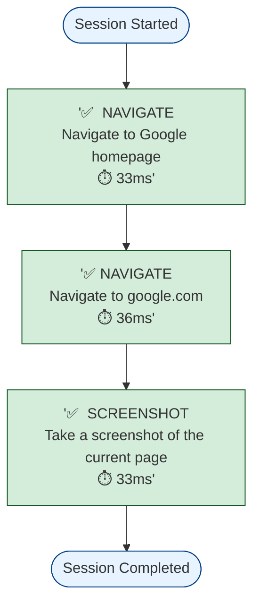

# Execution Flow Diagram

```mermaid
graph TD
    Start([Session Started]) --> Step1
    Step1['✅  NAVIGATE<br/>Navigate to Google homepage<br/>⏱️ 33ms']
    style Step1 fill:#d4edda,stroke:#155724
    Step1 --> Step2
    Step2['✅  NAVIGATE<br/>Navigate to google.com<br/>⏱️ 36ms']
    style Step2 fill:#d4edda,stroke:#155724
    Step2 --> Step3
    Step3['✅  SCREENSHOT<br/>Take a screenshot of the current page<br/>⏱️ 33ms']
    style Step3 fill:#d4edda,stroke:#155724
    Step3 --> End([Session Completed])
    style Start fill:#e7f3ff,stroke:#004085
    style End fill:#e7f3ff,stroke:#004085

```