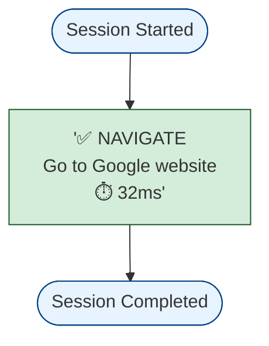

# Execution Flow Diagram

```mermaid
graph TD
    Start([Session Started]) --> Step1
    Step1['✅  NAVIGATE<br/>Go to Google website<br/>⏱️ 32ms']
    style Step1 fill:#d4edda,stroke:#155724
    Step1 --> End([Session Completed])
    style Start fill:#e7f3ff,stroke:#004085
    style End fill:#e7f3ff,stroke:#004085

```